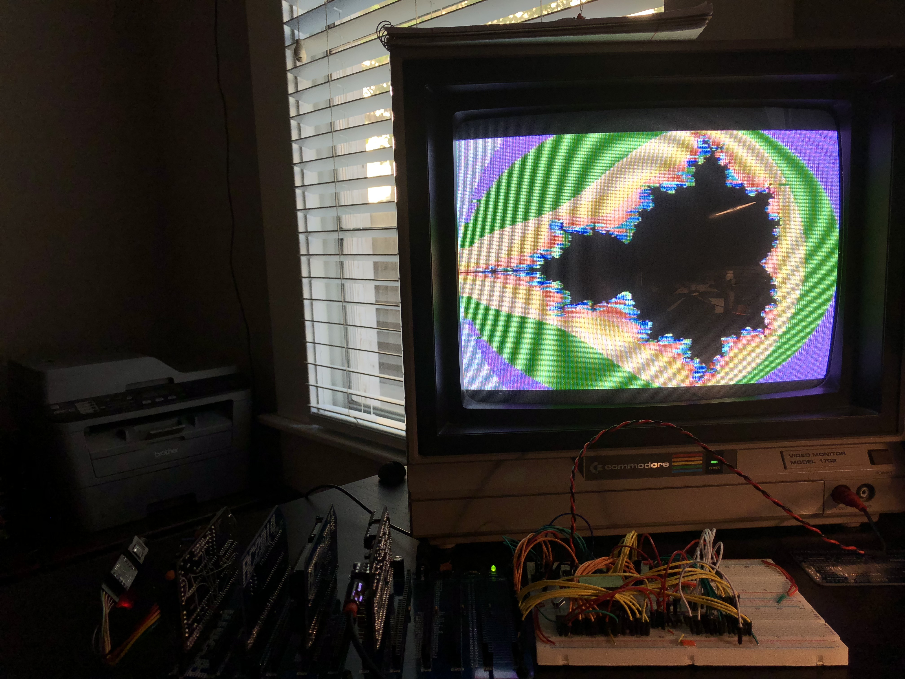

# rc9918

This is a TMS9918A-based video card I am building for the RC2014. It allows the RC2014 to produce NTSC composite graphics using a classic chip of the 1980s. The TMS9918A was used in the TI-99/4A, MSX, ColecoVision, original Sega SG-1000. Enhanced derivatives were used in later MSX computers, the Sega Master System, and the Sega Genesis. It also influenced the architecture of the PPU in the Nintendo Entertainment System. This board can be configured to use the same ports as the MSX, so it's possible to run some MSX software on it unmodified.

This is based on a [circuit](https://retrobrewcomputers.org/n8vem-pbwiki-archive/0/35845334/48860720/33053543/SRAM%20Replacement%20for%20TMS99x8%20VRAM.pdf) described by Tom LeMense for interfacing the TMS9918A with SRAM.  I took his schematics, added port address decoding and laid out the circuit on an RC2014 module.

The TMS9918 data and control ports map to 98 and 99, respectively. This allows some unmodified MSX programs to run on the RC2014. I have successfully gotten the Bold demo to run. The graphics from other programs should work as well, but other parts of the MSX, such as I/O may need additional hardware to work.

I have included an example Z80 assembly program, [tmsmandel.asm](tmsmandel.asm), which generates a Mandelbrot on the TMS9918. I am also adding support for the TMS9918 to my [z80ctrl](https://github.com/jblang/z80ctrl) project.

The board has been built and tested using the gerber files generated from this project. The gerber files are available for direct download on the Hackaday page linked below.

In addition to the PCB, I used the following materials: 

- TMS9918A chip. Available on ebay. The TMS9918 without the A is missing a graphics mode.  
- KLPX-048A-2-Y RCA connector. Other models may not fit.  
- FBA04HA600VB-00 ferrite bead. I got a message from Mouser that it is end of life now.  Other ferrite beads should work fine. The closer in size to the footprint of a 1/4W resistor, the better it will fit. 
- AS6C62256 or compatible 32KB RAM.  I have put two footprints so either a wide or skinny DIP-28 will work as long as the pin-out is the same. I have also tested the circuit with a UM61M256K-15 32K RAM chip salvaged off of an old Pentium motherboard (where it was used for cache).
- LFXTAL029962REEL 10.73866MHz crystal with 16pf caps. 
- 1 74HCT32 Quad OR gate
- 1 74HCT04 Hex Inverter
- 3 74HCT574 Octal Flip-Flops 
- 9 .1uf caps (bypass caps for each chip and one for the video output circuit)
- 2N4401 NPN transistor. Any NPN with similar characteristics should work. 
- 1 each 75 ohm, 470 ohm, and 0 ohm resistors. Wire jumper can be used in place of 0 ohm resistor.
- 40 pin right angle header
- 2x8 pin straight header and 1 jumper block

Aside from the TMS9918A, all parts are available from Mouser and probably other suppliers as well.

Resources:

- [TMS9918 Manual](http://map.grauw.nl/resources/video/texasinstruments_tms9918.pdf)
- [TI VDP Programmer's Guide](http://map.grauw.nl/resources/video/ti-vdp-programmers-guide.pdf)
- [More TMS9918 Documents](https://github.com/cbmeeks/TMS9918)
- [Discussion Thread](https://groups.google.com/d/topic/rc2014-z80/0m0kbzIJ3tw/discussion)
- [Hackaday Page](https://hackaday.io/project/159057-rc9918)

